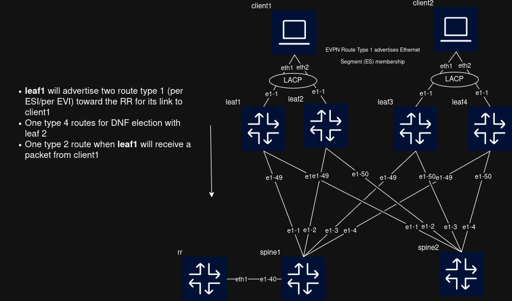

# EVPN Multihoming Lab (SRLinux & FRR)



Small [Containerlab](https://containerlab.dev/) lab using **Nokia SR Linux** and **FRR** to test EVPN L2VPN **Route Type 1** and **multihoming**.

## Goal

Test EVPN multihoming for two clients without using proprietary technologies such as vPC/MLAG.

The lab uses:

* **SR Linux** for EVPN
* **FRR** as the BGP Route Reflector
* **Basic LACP** for client connections
* **EVPN Route Type 1** for Ethernet Segment discovery

The goal is to keep the setup simple and based on standard protocols.

## Run

```bash
sudo containerlab deploy 
```
You can then ssh to leafs or spine doing <ssh leaf1> for example, password is NokiaSrl1!
