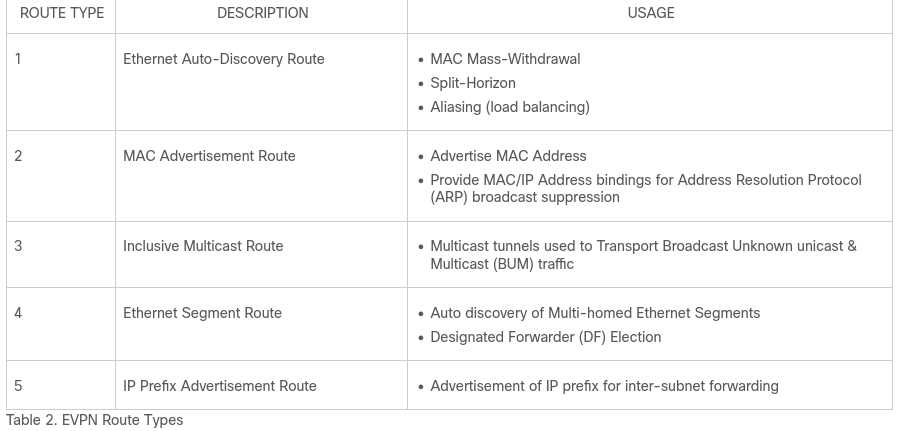

# EVPN Multihoming Lab (SRLinux & FRR)

Small [Containerlab](https://containerlab.dev/) lab using **Nokia SR Linux** and **FRR** to test EVPN L2VPN **Route Type 1** and **multihoming**.


## Route type




Route type 1 will be used by other peers to know about the ESI, but also for these features

 - MAC Mass-Withdrawal
 - Split-Horizon
 - Aliasing (load balancing)

Route type 4 is Ethernet Segment  route used for the DF election so when a leaf within a pair of leaf receives a BUM packet it will drop the packet


## Goal

Test EVPN multihoming for two clients without using proprietary technologies such as vPC/MLAG.

The lab uses:

* **SR Linux** for EVPN
* **FRR** as the BGP Route Reflector
* **Basic LACP** for client connections
* **EVPN Route Type 1** for Ethernet Segment discovery

The goal is to keep the setup simple and based on standard protocols.

## Run

```bash
sudo containerlab deploy 
```
You can then ssh to leafs or spine doing 'ssh leaf1' for example, password is NokiaSrl1!

You can then ping from one client to another and see how RT1 and RT2 works
